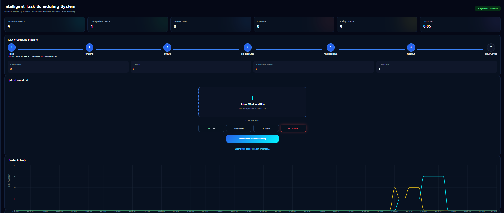
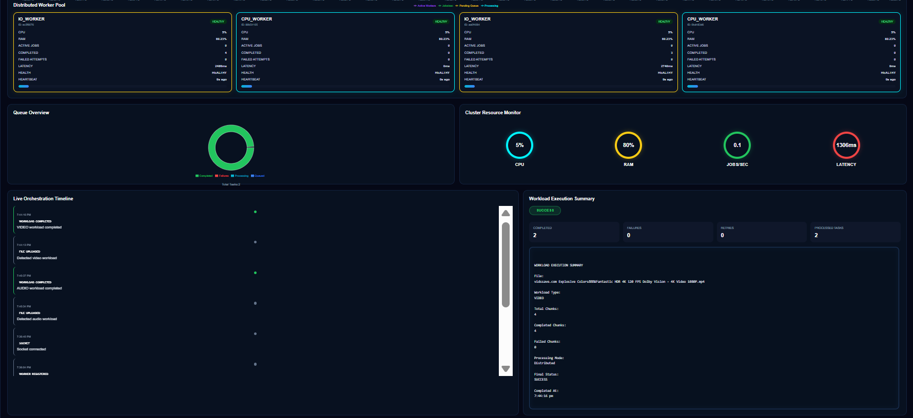

# Intelligent Task Scheduling System with Real-Time Monitoring

A distributed task orchestration system designed to intelligently schedule heterogeneous workloads across specialized workers while providing real-time visibility into task execution, worker health, queue activity, resource utilization, and scheduling decisions.

The system uses a metric-based scheduling approach to select suitable workers based on specialization, current load, health status, execution latency, and task priority. It also supports parallel workload processing, failure recovery, retry mechanisms, dynamic worker scaling, and real-time telemetry.

---

## Overview

Modern task-processing systems often need to handle workloads with different computational and I/O characteristics. Assigning tasks without considering worker specialization or runtime conditions can lead to inefficient resource utilization and poor workload distribution.

The **Intelligent Task Scheduling System with Real-Time Monitoring** addresses this problem through a distributed orchestration architecture that:

- Classifies incoming workloads
- Routes tasks to specialized CPU or I/O workers
- Considers worker load, health, and execution latency during scheduling
- Supports priority-aware task scheduling
- Divides suitable workloads into chunks for parallel execution
- Handles worker failures through retries and reassignment
- Dynamically adds worker capacity when workload conditions require it
- Provides real-time monitoring through an interactive dashboard

The system supports workloads including **PDF, image, audio, and video files**.

---
## Dashboard Preview

### System Monitoring Dashboard

### Workload Execution and Worker Monitoring

---

## Key Features

### Intelligent Task Scheduling

The scheduler evaluates available workers before assigning a task.

Worker selection considers:

- Worker specialization
- Current worker load
- Worker health status
- Average execution latency
- Task priority
- Runtime performance information

Scheduling decisions are also exposed through telemetry, allowing worker selection to be observed through the monitoring dashboard.

### Specialized Worker Pool

The system uses specialized workers for different workload characteristics.

| Worker Type | Typical Workloads |
| --- | --- |
| CPU Workers | PDF, Image, Compute-oriented tasks |
| I/O Workers | Audio, Video, File-intensive tasks |

The default PM2 configuration starts **2 CPU workers and 2 I/O workers**.

### Parallel Workload Processing

Suitable workloads can be divided into multiple chunks and processed independently.

The scheduler distributes chunks across available workers, enabling parallel workload execution. After all required chunks are completed, the parent task is finalized and temporary chunk data is cleaned.

### Priority-Aware Scheduling

Tasks support four priority levels:

- Low
- Normal
- High
- Critical

Priority information is incorporated into the scheduling process and influences task execution decisions.

### Fault Handling and Retry

The system includes failure detection and retry mechanisms.

If a worker execution attempt fails:

1. The failure is detected and recorded.
2. The task can be reassigned to another suitable worker.
3. Execution is retried according to the configured retry policy.
4. The task is marked as permanently failed if the retry limit is exhausted.

### Dynamic Worker Scaling

The system includes dynamic worker management for handling increased workload demand.

When configured workload conditions are reached, additional workers can be spawned dynamically. These workers connect to the backend, register with the scheduler, and become available for task execution.

When a dynamic worker remains idle beyond the configured timeout, it is automatically terminated.

Current development configuration:

| Setting | Value |
| --- | --- |
| Queue Threshold | 8 |
| Maximum Dynamic Workers | 4 |
| Dynamic Worker Idle Timeout | 120000 ms |
| Worker Spawn Cooldown | 10000 ms |

### Distributed Queue Management

The project uses **Redis** and **BullMQ** for asynchronous task queue management.

The queue infrastructure supports task queuing, distributed worker execution, queue event monitoring, failure handling, and retry workflows.

### Real-Time Monitoring

The system uses **Socket.IO** for real-time communication between the backend and monitoring dashboard.

The dashboard provides visibility into:

- Task execution progress
- Worker activity and health
- Worker load
- CPU and memory utilization
- Queue activity
- Scheduling decisions
- Task completion
- Failures and retries
- Dynamic worker activity
- Cluster activity
- Runtime telemetry

---

## Monitoring Dashboard

The React-based monitoring dashboard provides a centralized view of the orchestration system.

### Metrics Cards
Displays high-level runtime and workload statistics.

### Task Pipeline
Visualizes the progress of workloads through different processing stages.

### Worker Panel
Displays registered workers and their runtime information, including worker type, health, current load, CPU usage, memory usage, jobs processed, average latency, and heartbeat status.

### Queue Overview
Provides visibility into current queue activity and workload state.

### Cluster Activity
Displays cluster-level processing activity and workload trends.

### Resource Monitor
Shows resource utilization information reported by active workers.

### Telemetry Panel
Displays real-time scheduling and orchestration events.

### Execution Summary
Provides execution-related metrics and task processing statistics.

---

## System Architecture

The system consists of the following main layers:

1. **React Frontend** – Provides the monitoring dashboard and workload upload interface.
2. **Node.js and Express Backend** – Handles API requests, file uploads, orchestration, and real-time communication.
3. **Intelligent Scheduler** – Evaluates available workers and selects suitable workers using runtime scheduling metrics.
4. **Redis and BullMQ** – Provide asynchronous queue management and task distribution.
5. **CPU and I/O Workers** – Process workloads according to their specialization.
6. **Dynamic Worker Manager** – Creates additional worker capacity when configured workload conditions are reached.
7. **MongoDB** – Stores task information and worker metrics.
8. **Socket.IO** – Provides real-time communication between the backend and monitoring dashboard.

---

## Workload Execution Flow

The typical task execution process is:

**Upload → Validation → Classification → Task Creation → Chunking (if required) → Priority Assignment → Scheduling → Worker Selection → Queue → Worker Execution → Completion → Cleanup → Dashboard Update**

If a worker execution attempt fails, the system applies the configured retry and reassignment mechanism before marking the task as permanently failed.

---

## Technology Stack

### Backend

| Technology | Purpose |
| --- | --- |
| Node.js | Backend runtime |
| Express.js | HTTP server and API layer |
| MongoDB | Task and metrics persistence |
| Mongoose | MongoDB object modeling |
| Redis | Queue infrastructure |
| BullMQ | Distributed task queue management |
| Socket.IO | Real-time communication |
| Multer | File upload handling |
| PM2 | Worker process management |

### Frontend

| Technology | Purpose |
| --- | --- |
| React | Monitoring dashboard |
| Axios | HTTP communication |
| Socket.IO Client | Real-time backend events |
| Recharts | Data visualization |
| Framer Motion | UI animations |
| Lucide React | Interface icons |

---

## Project Structure

    intelligent_task_scheduler/
    │
    ├── backend/
    │   ├── config/
    │   │   ├── db.js
    │   │   └── redis.js
    │   ├── models/
    │   │   ├── Task.js
    │   │   └── WorkerMetrics.js
    │   ├── queues/
    │   │   ├── queueEvents.js
    │   │   └── taskQueue.js
    │   ├── scheduler/
    │   │   └── scheduler.js
    │   ├── utils/
    │   │   ├── dynamicWorkerManager.js
    │   │   └── eventLogger.js
    │   ├── workers/
    │   │   └── worker.js
    │   ├── server.js
    │   ├── resetSystem.js
    │   ├── ecosystem.config.js
    │   ├── .env.example
    │   └── package.json
    │
    ├── frontend/
    │   ├── public/
    │   ├── src/
    │   │   ├── components/
    │   │   ├── context/
    │   │   ├── services/
    │   │   ├── App.jsx
    │   │   ├── App.css
    │   │   └── index.js
    │   └── package.json
    │
    ├── .gitignore
    └── README.md

---

## Prerequisites

Before running the project, ensure the following are installed:

- Node.js
- npm
- MongoDB
- Redis
- PM2

The current Windows development environment uses Redis through Ubuntu/WSL.

Install PM2 globally if required:

    npm install -g pm2

---

## Installation

Clone the repository:

    git clone https://github.com/deerajkumar03/intelligent-task-scheduling-system.git

Navigate to the project:

    cd intelligent-task-scheduling-system

Install backend dependencies:

    cd backend
    npm install

Install frontend dependencies:

    cd ../frontend
    npm install

---

## Environment Configuration

Create a `.env` file inside the `backend` directory using `.env.example` as a reference.

Example local development configuration:

    MONGO_URI=mongodb://127.0.0.1:27017/intelligenttaskScheduler
    PORT=5000

    REDIS_HOST=127.0.0.1
    REDIS_PORT=6379

    NODE_ENV=development

    SERVER_URL=http://localhost:5000
    CLIENT_URL=http://localhost:3000

    MAX_ACTIVE_JOBS=3

    MAX_DYNAMIC_WORKERS=4
    DYNAMIC_WORKER_QUEUE_THRESHOLD=8
    DYNAMIC_WORKER_IDLE_TIMEOUT=120000
    DYNAMIC_WORKER_SPAWN_COOLDOWN=10000

    ENABLE_FAILURE_SIMULATION=false
    FAILURE_RATE=0.15

The actual `.env` file is excluded from Git tracking. Do not commit credentials, secrets, or sensitive environment configuration.

---

## Running the System

The application requires MongoDB, Redis, the backend server, worker processes, and the React frontend to run together.

### 1. Ensure MongoDB Is Running

The backend uses the following local MongoDB instance:

    mongodb://127.0.0.1:27017/intelligenttaskScheduler

Ensure the local MongoDB service is running before starting the backend.

### 2. Verify Redis

Open Ubuntu/WSL and connect to Redis:

    redis-cli

Verify the connection:

    127.0.0.1:6379> ping
    PONG

A `PONG` response confirms that Redis is running and accessible.

If Redis is not running, start it using:

    redis-server

Keep Redis available while the application is running.

### 3. Start the Backend

Open a terminal and navigate to the backend directory:

    cd backend

Start the backend server:

    node server.js

A successful startup confirms Redis and MongoDB connections and starts the server on port `5000`.

### 4. Start the Workers

Open another terminal:

    cd backend
    pm2 start ecosystem.config.js

Verify worker status:

    pm2 list

The default configuration starts **2 CPU workers and 2 I/O workers**.

### 5. Start the Frontend

Open another terminal:

    cd frontend
    npm start

The React frontend runs at:

**http://localhost:3000**

The backend runs at:

**http://localhost:5000**

---

## Testing

The system has been tested with multiple workload types, including:

- PDF files
- Image files
- Video files

The following functionality has been validated:

- Workload classification
- CPU and I/O worker routing
- Specialized worker selection
- Load-aware scheduling
- Priority-aware scheduling
- Multi-chunk workload processing
- Parallel chunk distribution
- Task completion
- Worker failure detection
- Retry and task reassignment
- Permanent failure handling
- Dynamic worker spawning
- Dynamic worker registration
- Dynamic worker idle termination
- Queue monitoring
- Real-time telemetry
- Worker resource monitoring
- Temporary chunk cleanup

---

## Failure Simulation

The project includes optional failure simulation for testing retry and recovery behavior.

To enable failure simulation, set:

    ENABLE_FAILURE_SIMULATION=true

The simulated failure probability is controlled using:

    FAILURE_RATE=0.15

For normal operation:

    ENABLE_FAILURE_SIMULATION=false

This functionality is intended for testing failure detection, retry handling, and worker reassignment.

---

## Future Enhancements

Potential future improvements include:

- Docker-based containerization
- Kubernetes-based worker orchestration and auto-scaling
- Multi-machine distributed deployment
- Advanced scheduling algorithms
- Machine-learning-based workload prediction
- Authentication and authorization
- Role-based dashboard access
- Persistent task result management
- Distributed tracing
- Prometheus and Grafana integration
- Cloud deployment
- Performance benchmarking under concurrent workloads

---

## Project Scope

This project is an academic distributed task orchestration prototype developed to demonstrate:

- Metric-based intelligent scheduling
- Distributed worker coordination
- Specialized workload processing
- Parallel task execution
- Priority-aware scheduling
- Dynamic worker management
- Fault handling and retry mechanisms
- Queue-based asynchronous processing
- Real-time monitoring and telemetry
- Worker resource monitoring

The project focuses on demonstrating the architecture and behavior of an observable, workload-aware distributed task processing system.

---

## Author

**Deeraj Kumar**

Master of Computer Applications (MCA)  
Major Project
